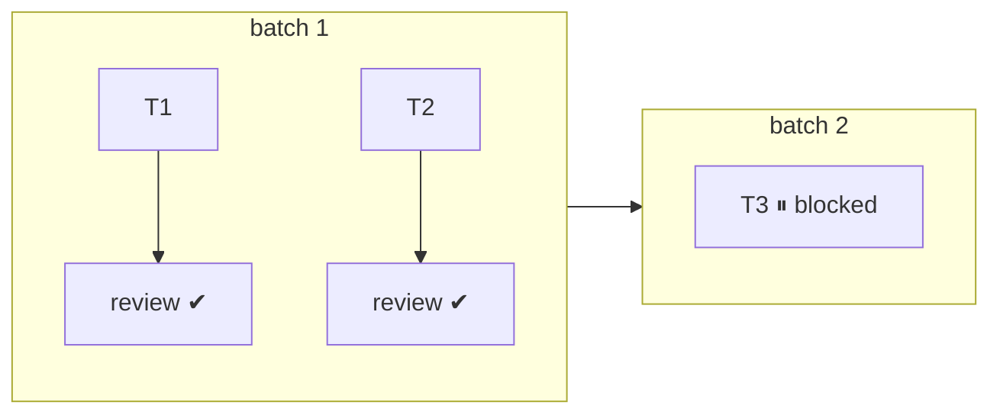

# Execution Tiers — mechanics

The tier invariants live inline in SKILL.md (they are load-bearing for the Completion Gate).
This file holds the per-tier mechanics. Background + rationale:
`docs/code-gen-parallelism-recommendations.md`.

## Tier table

| Tier | Condition | Behaviour |
|---|---|---|
| 1 | The `Workflow` tool exists (invoking this skill counts as the user's opt-in) | Parse the phase's tasks from `tasks.md` into `{id, description, files, parallel_safe}` objects and invoke the workflow with `args: {tasks, context, guidelines, implementerAgent: 'barnuri-dev-skills:implementer'}` (`guidelines` = the guideline file paths resolved by the Developer Guidelines step, `[]` when none). **Invoke by `scriptPath`** — resolve `../../workflows/code-gen-implement.js` relative to this skill's base directory to an absolute path (verified 2026-08-16: plugin workflows do not register by name, so `{name: 'code-gen-implement'}` fails with "not found"; only `scriptPath` works). It batches disjoint `[P]` tasks, pipelines implement→review per task, and gates any no-op review skip on git evidence. If the `implementer` agent type is unavailable in the session, omit that arg — the workflow falls back to its default subagent. Log every invocation to `workflow-runs.md` (see below). |
| 2 | A subagent tool (Agent/Task) exists, but no `Workflow` tool | Dispatch each disjoint `[P]` group as parallel subagent calls in a single message — the same pattern cr uses for its two reviewers. Cap 3–4 concurrent. Prefer the `barnuri-dev-skills:implementer` agent type (its definition already carries the scoping rules); with a generic subagent, give each one task, its file list, and an explicit rule that it must not write to `agent-spec/` or run git mutations. |
| 3 | Neither exists (e.g. opencode, pi, codex, cursor) | Serial, exactly as the per-task loop in SKILL.md — no behavioural change. |

## Tier 1 run visibility — `agent-spec/<slug>/workflow-runs.md`

The workflow runs in the background, so leave a parent-written trace: on invocation append a run
header (timestamp, run ID from the tool result, task ids sent); on the completion notification
append the per-task outcomes and a small mermaid graph of what actually ran — batches as
subgraphs, `impl --> review` per task, outcome marker on each node (✔ / ⏸ blocked /
✗ needs-fixes / ⤳ review skipped). Keep it minimal — one graph per run, node labels are just
task ids:

````markdown
## Run wf_… — 2026-08-16 12:40 · 3 tasks → 2 ✔ · 1 ⏸

````

This file is session state like plan.md/tasks.md: parent-written only, timestamp header on
create, never written by the workflow's agents.
